# Aura Optimizer Web

Single-binary Go web app for the Aura Optimizer storefront. Renders templated pages from [templates/](templates/) and serves static assets from [static/](static/). Includes two payment providers — PayPal (existing) and Stripe (added alongside).

## Run

```
make run
```

Default port is `3000`; override with `PORT`.

## Payment Integration

Two providers run side-by-side. Front-end chooses which to invoke.

### PayPal (existing)
- Server logic: [main.go:520-783](main.go#L520-L783)
- Endpoints: `POST /api/paypal/create-order`, `POST /api/paypal/capture-order`
- Env: `PAYPAL_CLIENT_ID`, `PAYPAL_SECRET`, `PAYPAL_BASE_URL` (defaults to live)

### Stripe (new)
- Service: [internal/payment/stripe.go](internal/payment/stripe.go) — wraps `stripe-go/v78`, creates PaymentIntents with automatic payment methods, verifies webhooks.
- Handler: [api/handlers/payment/stripe.go](api/handlers/payment/stripe.go) — HTTP layer.
- Routes are only registered if `STRIPE_SECRET_KEY` is present at boot.

| Method | Path                                  | Body / Notes                                   |
|--------|---------------------------------------|------------------------------------------------|
| POST   | `/api/stripe/create-payment-intent`   | `{"product_id":"..."}` → `{client_secret, id, amount, currency, status}` |
| POST   | `/api/stripe/webhook`                 | Stripe-signed event; handles `payment_intent.succeeded` to mark user Pro |

#### Env

| Variable                 | Required | Notes                                                          |
|--------------------------|----------|----------------------------------------------------------------|
| `STRIPE_SECRET_KEY`      | yes      | `sk_test_...` or `sk_live_...`. Without it, Stripe stays off.   |
| `STRIPE_WEBHOOK_SECRET`  | yes (for webhook) | `whsec_...` from your Stripe webhook endpoint config.    |

#### Flow

1. Browser hits `/checkout?product=<id>` and chooses Stripe.
2. Front-end calls `POST /api/stripe/create-payment-intent` with the product ID.
3. Server resolves price from [main.go](main.go) `Products`, calls Stripe, returns `client_secret`.
4. Front-end confirms with Stripe.js using `client_secret`.
5. Stripe posts `payment_intent.succeeded` to `/api/stripe/webhook`; handler marks `users[user_id].IsPro = true` using the `user_id` metadata stamped at intent creation.

### Architecture

```mermaid
flowchart LR
    %% ==== ENV & TEMPLATE ====
    env["env: STRIPE_PUBLISHABLE_KEY"] -->|"main.go reads at boot"| tmpl["checkout.html<br/>{{.StripePublishableKey}}"]

    %% ==== FRONTEND ====
    tmpl -->|"server renders"| browser["Browser<br/>(checkout.html)"]
    browser -->|"loads"| stripe_js["Stripe.js v3"]
    stripe_js --> elements["Card Element"]

    %% ==== CREATE INTENT (browser → backend → Stripe → back) ====
    browser -->|"POST /api/stripe/create-payment-intent<br/>{product_id}"| backend["main.go +<br/>StripeHandler / StripeService<br/>(secret key)"]
    backend -->|"paymentintent.New"| stripeAPI(["Stripe API<br/>api.stripe.com"])
    stripeAPI -->|"PaymentIntent"| backend
    backend -->|"client_secret"| browser

    %% ==== CONFIRM (browser ↔ Stripe directly) ====
    browser -->|"stripe.confirmCardPayment(client_secret)"| stripeAPI
    stripeAPI -->|"status: succeeded"| browser
    browser -->|"location = /download"| download["/download"]

    %% ==== WEBHOOK (server-side IsPro path) ====
    stripeAPI -.->|"payment_intent.succeeded"| webhook["POST /api/stripe/webhook<br/>(StripeHandler.Webhook)"]
    webhook -->|"webhook.ConstructEvent"| markPro["users[user_id].IsPro = true<br/>(in-memory map)"]

    %% ==== STYLES ====
    classDef ext fill:#fff9c4,stroke:#f9a825,stroke-width:2px;
    classDef be  fill:#d1c4e9,stroke:#5e35b1,stroke-width:2px;
    classDef fe  fill:#e0f7fa,stroke:#006064,stroke-width:2px;
    classDef env fill:#f8bbd0,stroke:#c2185b,stroke-width:2px;
    classDef ok  fill:#a5d6a7,stroke:#2e7d32,stroke-width:2px;

    class env env;
    class stripeAPI,stripe_js ext;
    class backend,webhook,markPro be;
    class tmpl,browser,elements fe;
    class download ok;
```



GitHub and VS Code (with the Mermaid Markdown extension) render the block above inline. CI parses the same source on every push to catch syntax errors.

## Local setup

```
go get github.com/stripe/stripe-go/v78
go mod tidy
export STRIPE_SECRET_KEY=sk_test_...
export STRIPE_WEBHOOK_SECRET=whsec_...   # use `stripe listen --forward-to localhost:3000/api/stripe/webhook` for dev
make run
```
